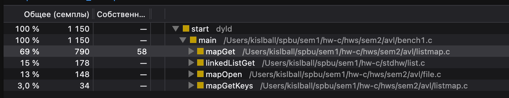
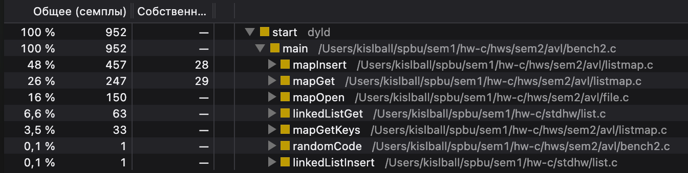

# Время выполнения сценариев
Система: MBA M4(10C, 10G), 16G RAM, macOS 26.4
||Bench 1|Bench 2|
|---|---|---|
|AVL|255ms$\pm$ 11.6ms|121ms $\pm$ 13.4ms|
|Связный список|1186ms $\pm$ 14.1ms|990ms $\pm$ 12.8ms|

# Профайлер для связного списка

Картинки содержат результаты работы профайлера для первого и второго бенчмарка соответственно.

В первом случае лидирует `mapGet`, который находился в стеке вызовов в 69% процентах семплов. Внутри него 35%
времени занимает операция поиска элемента в связном массиве. Можно также заметить, что количество
вызовов непостоянно --- ключи распределены по списку неравномерно, не существует порядка, поэтому
необходимо каждый раз проходить список по новой.

Во втором бенчмарке много времени(49%) занимает встраивание в мапу новых ключей. Текущая реализация включает
поиск по внутреннему массиву, чтобы переиспользовать уже существующие ключи. К этому добавляется
выделение памяти и т.д., поэтому эти вызовы тяжелее вызовов поиска(несмотря на то, что их 50/50).

# Почему такая разница?
На каждом шаге АВЛ-дерево сокращает диапазон поиска в два раза. Сложность такого поиска составляет
$O(\log n)$ в отличие от $O(n)$ в случае со связным списком. Для $insert$ соотношение меняется,
поскольку для переиспользования ключей и чистки памяти необходимо пройти список заново.

Можно также встраивать элемент в начало списка, таким образом память не будет переиспользоваьтся,
но встраивание нового ключа будет занимать $O(1)$.

# Вывод для директора
Предыдущая реализация использовала неоптимальный алгоритм, время исполнения которого растёт быстро
при увеличении размеры входных данных. Он заменён на более оптимальный алгоритм, который, при
всех практических применениях, сравним по времени с работой предыдущего на 128 записях[^1].

[^1]: Не начальнику: разумно предположить, что в реальном мире не хватит памяти на $2^128$
каких-либо значащих записей.
